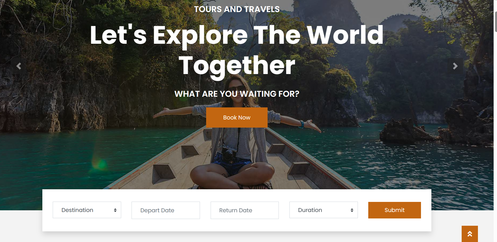
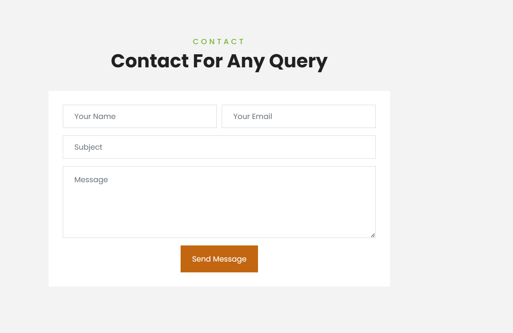
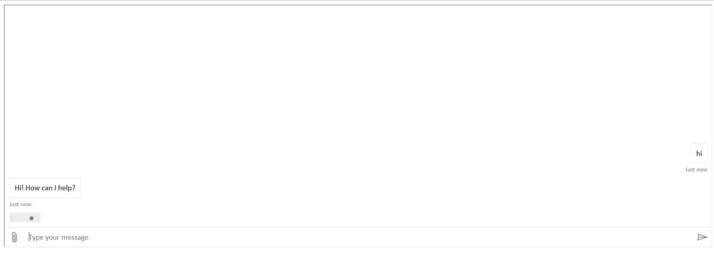
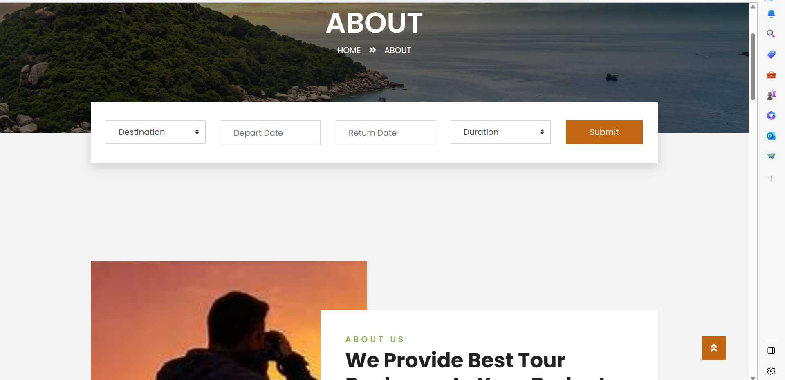
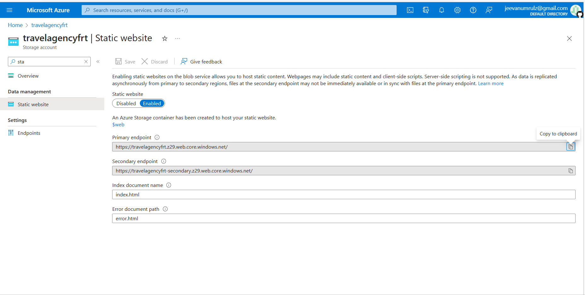

# FRT_final_project
This is our Final project of Future Ready Talent Virtual Internship
This is a web based application developed for Travel Agency.

### This web based Travel Agency has been developed for the accomplishment of Future Ready Talent Internship program launched by Microsoft, Future Skills Prime, Quess, Github and EY.

**Project Link** -https://travelagencyfrt.z29.web.core.windows.net/

## Features and Functionalities 😃

- Interactive and responsive UI.
- Has many graphical and visual innovative effects.
- Have an aesthetically pleasing visual design and architecture.
- Has collection of many web pages including Home, About, Contact Us,Services, Pages,Health Bot,Tourpackages etc.
- User is able to book a travel services and bookings through the website.

## Azure Technologies Used-
-Health Bot(To handle emergency conditions that may arise and to take precautions).
-Azure Blob Storage

## Screenshots 📸

### Home page -  

### services page -

### Contact page -

### health bot Page -

### About Us Page -

### Tour Packages Page -

### Azure Services Portal Page -

## Tech Stack 💻

- [Azure(Hosting)](https://azure.microsoft.com/en-in/features/azure-portal/)
- HTML
- CSS
- Bootstrap
- JavaScript
